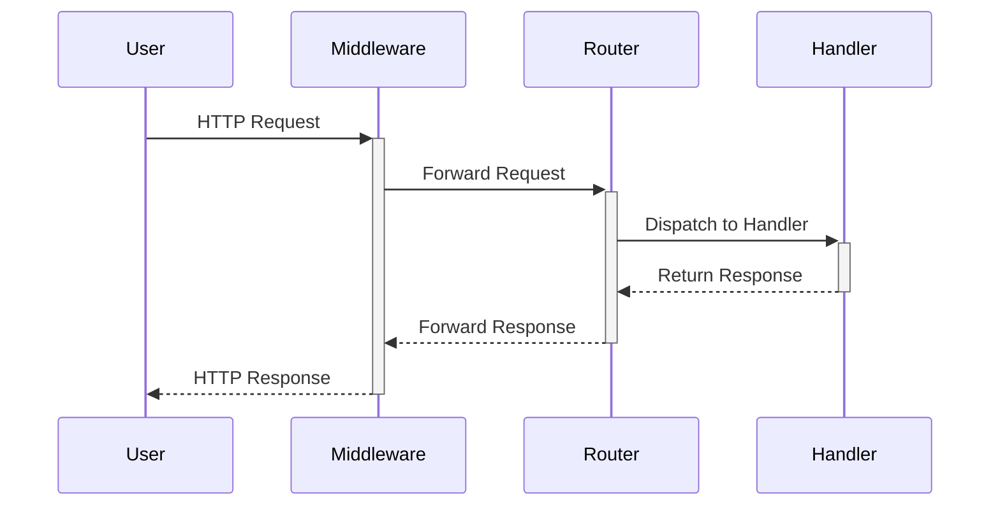

# go-serve

A lightweight, production-ready, zero-dependency scaffold for building high-performance HTTP services in Go. This project emphasizes standard library utilization to ensure long-term stability and minimal supply chain risk.

## Architecture

The server follows a simple request-response flow, with middleware for cross-cutting concerns like logging and recovery.



## Getting Started

### Using this Template

To start a new project using `go-serve` as a template, it's recommended to clone the latest release tag to get a clean, stable starting point.

```bash
# Replace v1.0.0 with the desired release tag
git clone --depth 1 --branch v1.0.0 https://github.com/maranix/go-serve.git my-new-project
cd my-new-project

# Remove the .git directory to start a fresh Git history
rm -rf .git

# Initialize your new Git repository
git init
git add .
git commit -m "feat: initial commit from go-serve template"
```

### Prerequisites
- Go 1.25+

### Running the Server
To run the server locally:
```bash
make run
```
The server will start on the port specified by the `PORT` environment variable (defaults to 8080).

### Running Tests
To run the test suite:
```bash
make test
```

### Linting
To check the code for potential issues:
```bash
make lint
```

## How to Extend

`go-serve` is designed to be a blank canvas. Here’s how to add a database connection.

1.  **Create a Store Package:**
    Create a new package under `internal/store`. This package will be responsible for all database interactions.

    ```go
    // internal/store/db.go
    package store

    import "database/sql"

    type Store struct {
        db *sql.DB
    }

    func New(db *sql.DB) *Store {
        return &Store{db: db}
    }

    // Add your database methods here...
    // func (s *Store) GetUser(id string) (*User, error) { ... }
    ```

2.  **Instantiate in `main.go`:**
    In `cmd/api/main.go`, instantiate your database connection and pass it to your new store.

    ```go
    // cmd/api/main.go
    // ...
    // import "go-serve/internal/store"

    func main() {
        // ... (config and logger setup)

        // Example for PostgreSQL
        // connStr := "user=... password=... dbname=... sslmode=disable"
        // db, err := sql.Open("postgres", connStr)
        // if err != nil {
        //     logger.Error("failed to connect to database", "error", err)
        //     os.Exit(1)
        // }
        //
        // dbStore := store.New(db)

        // ...
    }
    ```

3.  **Inject into Handlers:**
    Update your `server.Server` struct to hold the store, and pass it down to your handlers.

    First, update `internal/server/server.go`:
    ```go
    // internal/server/server.go
    // ...
    // import "go-serve/internal/store"

    type Server struct {
        //...
        // store *store.Store
    }

    // Update New() to accept the store
    // func New(store *store.Store, ...) *Server {
    // ...
    // s := &Server{
    //     ...
    //     store: store,
    // }
    ```

    Next, modify your handlers to be methods on a handler struct that holds the store.
    ```go
    // internal/server/routes.go

    // Create a handler struct
    type Handlers struct {
        // store *store.Store
        logger *slog.Logger
    }

    // Example handler method
    // func (h *Handlers) HandleGetUser(w http.ResponseWriter, r *http.Request) {
    //     // user, err := h.store.GetUser(...)
    //     // ...
    // }

    // In server.routes()
    // func (s *Server) routes() {
    //    handlers := &Handlers{logger: s.logger}
    //    s.mux.HandleFunc("GET /users/{id}", handlers.HandleGetUser)
    // }
    ```
