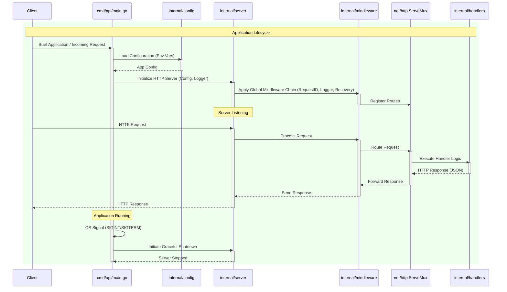

# go-serve

A lightweight, production-ready, zero-dependency scaffold for building high-performance HTTP services in Go. This project emphasizes standard library utilization to ensure long-term stability and minimal supply chain risk.

## Architecture

`go-serve` adheres to the **Standard Go Project Layout** with a simplified Clean Architecture approach, prioritizing minimalism, extensibility, and observability. This structure facilitates clear separation of concerns and maintainable code, making it easy to extend for various service needs.

### Project Structure

*   **cmd/**: Contains the main application entry points.
    *   `cmd/api/main.go`: The primary executable for the HTTP API service, responsible for bootstrapping the application, loading configuration, initializing the server, and handling graceful shutdown.
*   **internal/**: Houses private application logic that is not intended for public consumption by other Go projects. This prevents other projects from importing these internal packages, enforcing a clear boundary.
    *   `internal/config/`: Manages environment variable parsing and application configuration using only the standard library's `os` package. It ensures critical configurations are present or sensible defaults are applied.
    *   `internal/server/`: Encapsulates the HTTP server setup, including route definitions, server instance creation, and the graceful shutdown mechanism using `os/signal` and `context.WithTimeout`.
    *   `internal/middleware/`: Provides custom standard library HTTP middleware for cross-cutting concerns such as structured logging (`log/slog`), request ID generation, and panic recovery.
    *   `internal/handlers/`: Contains the HTTP handler functions that implement the application's business logic. These handlers are designed to be "zero global state," meaning configuration and logger instances are injected into the server and then passed to handlers, promoting testability and clarity.
*   **pkg/**: Intended for public library code that *can* be safely used by external applications or other projects within a larger monorepo. (Currently empty, as per the minimalist philosophy, but available for future expansion).

### Core Architectural Principles

1.  **Standard Library First:** `go-serve` is built almost exclusively on Go's standard library (`net/http`, `log/slog`, `os`, `context`, `os/signal`, etc.), minimizing external dependencies and supply chain risk.
2.  **Zero Global State:** Configuration and `log/slog` logger instances are explicitly injected into the `Server` struct and subsequently passed down to middleware and handlers. This design choice enhances testability, reduces side effects, and improves code clarity.
3.  **Extensibility as a Blank Canvas:** The template provides a robust foundation without imposing specific database, message queue, or external client choices. Developers are guided on *where* to integrate such components (e.g., in `internal/store` for database logic).
4.  **Observability Built-in:** Structured JSON logging (`log/slog`) and metrics-readiness are fundamental components, integrated via middleware, to provide immediate insights into application behavior.
5.  **Graceful Shutdown:** The server is configured to handle `SIGINT` and `SIGTERM` signals, allowing for a controlled shutdown to complete ongoing requests and release resources, ensuring data integrity during deployments or restarts.


The following diagram illustrates the typical request lifecycle and architectural components:



## Getting Started

### Using this Template

To start a new project using `go-serve` as a template, it's recommended to clone the latest release tag to get a clean, stable starting point.

```bash
# Replace v1.0.0 with the desired release tag
git clone --depth 1 --branch v1.0.0 https://github.com/maranix/go-serve.git my-new-project
cd my-new-project

# Remove the .git directory to start a fresh Git history
rm -rf .git

# Initialize your new Git repository
git init
git add .
git commit -m "feat: initial commit from go-serve template"
```

### Using the Setup Script

For an even quicker setup in an empty or newly initialized Git repository, you can use the `setup-template.sh` script:

1.  **Download the script:**
    ```bash
    curl -LJO https://raw.githubusercontent.com/maranix/go-serve/main/setup-template.sh
    chmod +x setup-template.sh
    ```
    (Note: Replace `main` with `v1.0.0` or your desired release branch/tag if you want to use a specific version of the script.)

2.  **Run the script:**
    ```bash
    ./setup-template.sh
    ```
    This script will automatically clone the template, copy the files, and perform an initial Git commit for you.

### Prerequisites
- Go 1.25+

### Running the Server
To run the server locally:
```bash
make run
```
The server will start on the port specified by the `PORT` environment variable (defaults to 8080).

### Running Tests
To run the test suite:
```bash
make test
```

### Linting
To check the code for potential issues:
```bash
make lint
```

### Running with Docker
To build the Docker image:
```bash
make docker-build
```

To build and run the Docker container (it will be removed automatically on exit):
```bash
make docker-run
```
The server inside the container will be accessible on port 8080 of your host machine.

## How to Extend

`go-serve` is designed to be a blank canvas. Here’s how to add a database connection.

1.  **Create a Store Package:**
    Create a new package under `internal/store`. This package will be responsible for all database interactions.

    ```go
    // internal/store/db.go
    package store

    import "database/sql"

    type Store struct {
        db *sql.DB
    }

    func New(db *sql.DB) *Store {
        return &Store{db: db}
    }

    // Add your database methods here...
    // func (s *Store) GetUser(id string) (*User, error) { ... }
    ```

2.  **Instantiate in `main.go`:**
    In `cmd/api/main.go`, instantiate your database connection and pass it to your new store.

    ```go
    // cmd/api/main.go
    // ...
    // import "go-serve/internal/store"

    func main() {
        // ... (config and logger setup)

        // Example for PostgreSQL
        // connStr := "user=... password=... dbname=... sslmode=disable"
        // db, err := sql.Open("postgres", connStr)
        // if err != nil {
        //     logger.Error("failed to connect to database", "error", err)
        //     os.Exit(1)
        // }
        //
        // dbStore := store.New(db)

        // ...
    }
    ```

3.  **Inject into Handlers:**
    Update your `server.Server` struct to hold the store, and pass it down to your handlers.

    First, update `internal/server/server.go`:
    ```go
    internal/server/server.go
    ...
    <!-- import "go-serve/internal/store" -->

    type Server struct {
        //...
        store *store.Store
    }

    Update New() to accept the store
    func New(store *store.Store, ...) *Server {
    ...
    s := &Server{
        ...
        store: store,
    }
    ```

    Next, modify your handlers to be methods on a handler struct that holds the store.
    ```go
    <!-- internal/server/routes.go -->

    Create a handler struct
    type Handlers struct {
        store *store.Store
        logger *slog.Logger
    }

    Example handler method
    func (h *Handlers) HandleGetUser(w http.ResponseWriter, r *http.Request) {
        // user, err := h.store.GetUser(...)
        // ...
    }

    In server.routes()
    func (s *Server) routes() {
       handlers := &Handlers{logger: s.logger}
       s.mux.HandleFunc("GET /users/{id}", handlers.HandleGetUser)
    }
    ```
    
    This comprehensive example demonstrates how to integrate a database into your `go-serve` application. Remember to adapt the connection string and repository logic to your specific database and application needs. This pattern ensures a clean separation of concerns and maintainable code.

## Contributing

We welcome contributions to `go-serve`! Please see our [CONTRIBUTING.md](CONTRIBUTING.md) for details on how to get started, our code of conduct, and submission process.

## License

This project is licensed under the MIT License - see the [LICENSE](LICENSE) file for details.
